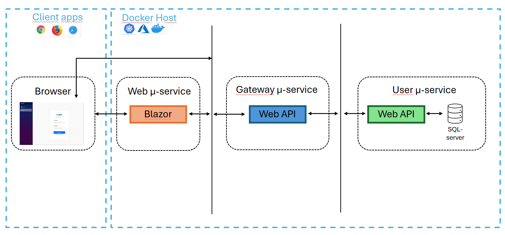
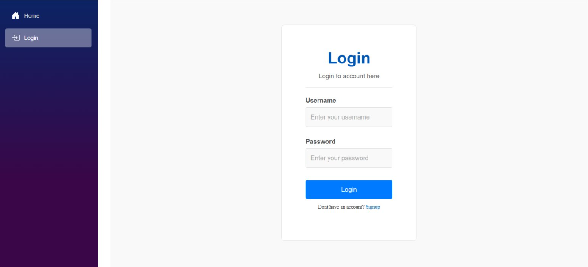

# MeTube-DevOps

## Description
This is our group project for our DevOps course.

It's supposed to be a simple YouTube-inspired web application that demonstrates core video streaming concepts—uploading, searching, and playing videos—while focusing on clean design and user-friendly interactions.
The microservices that we managed to create are *Gateway*, *Client* and *UserService*.
But we only managed to finish the sign-up and log-in features during our short sprints.

Authors: Ali Behrooz, Ronnie Samson, Abdulla Mehdi, Oskar Andreasson, Sebastian Svensson - Loop Legion

## Table of Contents
- [Documentation](#documentation)
- [Application Architecture](#application-architecture)
- [Screenshots](#screenshots)
- [Sprints](#sprints)
  - [Sprint 1](#sprint-1)
  - [Sprint 2](#sprint-2)
  - [Sprint 3](#sprint-3)
  - [Sprint 4](#sprint-4)

## Application Architecture

Diagram of our application architecture.

## Screenshots
Screenshot of the Signup page:

This is where you intput your information to create an account.

---

Screenshot of the Login page:

This is where you input you user information to login.

### Sprint 1
#### Planning
- **Sprint Backlog**:
  - *User Story 1*: As a user I should be able to sign up so that I have a user account.
  - *User Story 2*: As a developer, I want to setup Docker for the microservices.
  - *User Story 3*: As a developer I want the project to be setup with sub-projects for all microservices.

#### Review
- **Completed**:
  - *User Story 1*: Implementation of registration logic and functionality (Sign-Up).
  - *User Story 3*: Setup of microservice skeleton (not yet implemented).
- **Not Completed**:
  - *User Story 2*: Docker setup not implemented (Not enough time).
- **Issues**:
  - Integration with the database took longer than expected.
  - We had environment setup issues.
  - Very short sprint period, only 3 days.

#### Retrospective
- **What went well**:
  - Clear communication in daily stand-ups.
  - Smooth process for defining user stories.
  - Good distribution of tasks.
  - Strong attendance and engagement
#### Retrospective
- **What went well**:
  - Clear communication in daily stand-ups.
  - Smooth process for defining user stories.
  - Good distribution of tasks.
  - Strong attendance and engagement
- **What could be improved**:
  - Unclear distribution of roles in certain parts of API development.
- **Amendments to process**:
  - Reconsider role distribution and possibly adapt a more vertical working approach.
  - Formalize code review steps.

---
