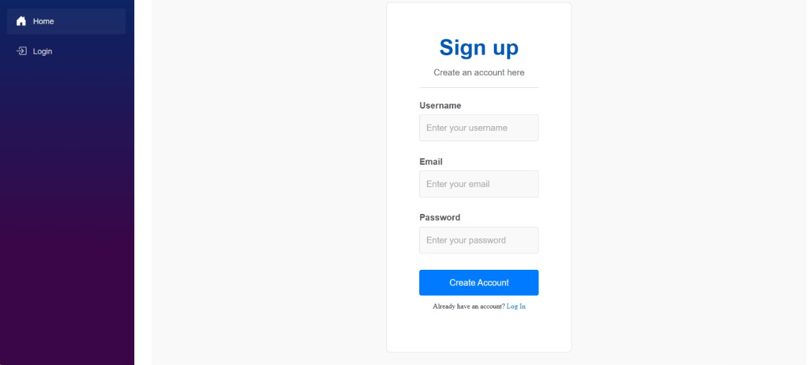

# MeTube-DevOps

## Description
This is our group project for our DevOps course.

It's supposed to be a simple YouTube-inspired web application that demonstrates core video streaming concepts—uploading, searching, and playing videos—while focusing on clean design and user-friendly interactions.
The microservices that we managed to create and deploy are *Gateway*, *Client* and *UserService*.
But we only managed to finish the sign-up and log-in features during our short sprints.

Authors: Ali Behrooz, Ronnie Samson, Abdulla Mehdi, Oskar Andreasson, Sebastian Svensson - Loop Legion


## Table of Contents
- [Application Architecture](#application-architecture)
- [Screenshots](#screenshots)
- [Infrastructure as Code](#infrastructure-as-code)
- [CI/CD Pipeline](#cicd-pipeline)
  - [Pipeline Workflow](#pipeline-workflow)
  - [Workflow Files](#workflow-files)
- [Application Programming Interface (API)](#application-programming-interface-api)
  - [UserService API](#userservice-api)
- [Resiliency](#resiliency)
- [Horizontal Autoscaling](#horizontal-autoscaling)
- [Sprints](#sprints)
  - [Sprint 1](#sprint-1)
  - [Sprint 2](#sprint-2)
  - [Sprint 3](#sprint-3)
  - [Sprint 4](#sprint-4)

## Application Architecture


Diagram of our application architecture.

## Screenshots
Screenshot of the Signup page:



This is where you intput your information to create an account.

---

Screenshot of the Login page:


This is where you input you user information to login.

## Infrastructure as Code
Our infrastructure is managed using Terraform with Azure as the cloud provider.

**Prerequisites**
- Terraform CLI installed
- Azure CLI installed and authenticated
- Subscription ID for your Azure account

**Deployment Steps**
1. Set your Azure subscription ID:
```bash
$env:TF_VAR_subscription_id = "your-subscription-id"
```

2. Initialize Terraform:
```bash
cd terraform
terraform init
```

3. Deploy the infrastructure:
```bash
terraform apply
```

4. Retrieve the outputs:
```bash
terraform output
```
  Note the container registry hostname, username, and other outputs for use in deployment.

**Teardown**
To destroy the infrastructure:
```bash
terraform destroy
```

## CI/CD Pipeline
Our continuous integration and delivery pipeline is implemented using GitHub Actions.

### Pipeline Workflow

1. **Trigger**: The pipeline is triggered on:
- Push to master branch
- Pull request to master branch
- Manual dispatch via GitHub Actions UI

2. **Integration Phase**:
- Builds the application
- Runs unit tests
- Runs integration tests with SQL Server in Docker
- Lints the code

3. **Delivery Phase** (on successful merge to master):
- Builds Docker images
- Pushes images to Azure Container Registry
- Updates Kubernetes deployments

### Workflow Files
- userservice-ci.yml: CI pipeline for UserService
- .github/workflows/cd-workflow.yml: CD pipeline for deployment

## Application Programming Interface (API)

### UserService API

**User Management**

- **GET /api/User/manageUsers**
  - Returns a list of all users
  - Requires: Admin authentication
  - Response: Array of user objects
 
- **POST /api/User/signup**
  - Creates a new user account
  - Request Body:
```bash
{
  "username": "string",
  "password": "string",
  "email": "string",
  "role": "string"
}
```
  - Response: Created user object

- **POST /api/User/login**
  - Authenticates a user
  - Request Body:
```bash
{
  "username": "string",
  "password": "string"
}
```
  - Response: Authentication token

**Health Check**

- **GET /health**
  - Returns the health status of the service
  - Response: Status code 200 if healthy

## Resiliency
The UserService implements several resiliency patterns:

- **Health Checks**: Kubernetes liveness probe at /health endpoint verifies service is operational
- **Readiness Checks**: Optional readiness probes ensure service is ready to accept traffic
- **Retry Policies**: Communication with the database uses exponential backoff retry policy
- **Connection Pooling**: SQL connections are pooled to improve performance and reliability
- **Graceful Degradation**: Service can operate with limited functionality when database is unavailable

Implementation details can be found in the UserService/Program.cs file.

## Horizontal Autoscaling

The UserService implements horizontal autoscaling using Kubernetes HPA:

- **Metrics**: CPU & Memory (both at 50% averageUtilization).
- **Scale Range**: 1–5 pods.
- **Stabilization Window**: 300s to avoid rapid scale toggles.
- **Policy**: selectPolicy: Max for quicker scale-ups under load.

Autoscaling definitions are in userservice.yml.


### Sprint 1
#### Planning
- **Sprint Backlog**:
  - *User Story 1*: As a user I should be able to sign up so that I have a user account.
  - *User Story 2*: As a developer, I want to setup Docker for the microservices.
  - *User Story 3*: As a developer I want the project to be setup with sub-projects for all microservices.

#### Review
- **Completed**:
  - *User Story 1*: Implementation of registration logic and functionality (Sign-Up).
  - *User Story 3*: Setup of microservice skeleton (not yet implemented).
- **Not Completed**:
  - *User Story 2*: Docker setup not implemented (Not enough time).
- **Issues**:
  - Integration with the database took longer than expected.
  - We had environment setup issues.
  - Hard time getting used to VSCode.

#### Retrospective
- **What went well**:
  - Clear communication in daily stand-ups.
  - Smooth process for defining user stories.
  - Good distribution of tasks.
  - Strong attendance and engagement
- **What could be improved**:
  - Unclear distribution of roles in certain parts of Microservice development.
- **Amendments to process**:
  - Reconsider role distribution and possibly work together to focus on a single microservice at a time.
  - Formalize code review steps.

---

### Sprint 2
#### Planning
- **Sprint Backlog**:
  - *User Story 1*: As a user, I want to be able to log out so that I'm logged out.
  - *User Story 2*: As an admin, I want to create, read, update, and delete user accounts so that I can manage users in the system.
  - *User Story 3*: As an authenticated user I want to manage my videos so that I can upload and delete them.
  - *User Story 4*: As an unauthenticated and authenticated user I want to be able to access videos so that I can watch them.
  - *User Story 5*: As a user, I want metadata about the video to be stored in persistent storage when a video is uploaded and removed when the video is deleted, so that I can efficiently manage and retrieve video information.
  - *User Story 6*: As an unauthenticated or authenticated user, I want to view a list of video metadata, so that I can quickly determine which videos are of interest to me before deciding to watch or take further action.

#### Review
- **Completed**:
  - *User Story 1*: Log out function implemented.
  - *User Story 2*: Admin account and functionality created and able to use CRUD operations in account management.
  - *User Story 3*: Video management and uploading functionality for users implemented.
  - *User Story 4*: Viewing of video content implemented.
  - *User Story 5*: Metadata implemented in the database and is deleted when video is deleted.
  - *User Story 6*: The client side still had CRUD functionality (list) left to implement but, we implemented it before the start of sprint 2.
- **Not Completed**:
  - All user stories completed by the start of the next sprint.
- **Issues**:
  - Problems with working vertically.

#### Retrospective
- **What went well**:
  - We basically managed to complete all user stories.
  - We did a lot, in a very short time span.
- **What could be improved**:
  - We bit off more than we could chew.
  - We should work on less user stories during our rather short sprints.
- **Amendments to process**:
  - Shorten the user stories during the next sprint.
  - Put less user stories in the Sprint Backlog.

---
